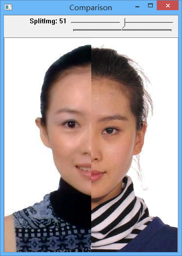

# ImageComparison

## Overview

ImageComparison is a tool for comparing images in one window. By dragging the trackbar in the window, the different columns can be compared in one window.


## Changelog

- 2015/8/15
Create the repository.

## Environment Requirement

- Opencv 3.0.0
- Visual Studio 2013 (If you just want to use the tool, install [Visual C++ Redistributable Packages for Visual Studio 2013 (x86)](http://www.microsoft.com/en-us/download/details.aspx?id=40784) instead.)

## Deployment

You can refer to [this](http://shuaihuang.github.io/2015/08/15/opencv-deployment/) for the procedure of deployment.

## How to use it?

1. Open a command window.
2. Switch the current folder to `<repository folfer>\bin\`.
3. Type in the following command, and press enter.

```
ImageComparison.exe <leftImgName> <rightImgName>
```
- `<leftImgName>`: The full path of one image file. (e.g. `D:\a.jpg`)
- `<rightImgName>`: The full path of the other image file. (e.g. `D:\b.jpg`)